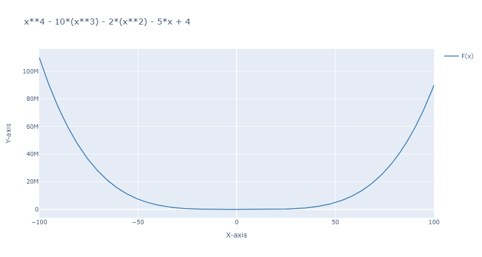
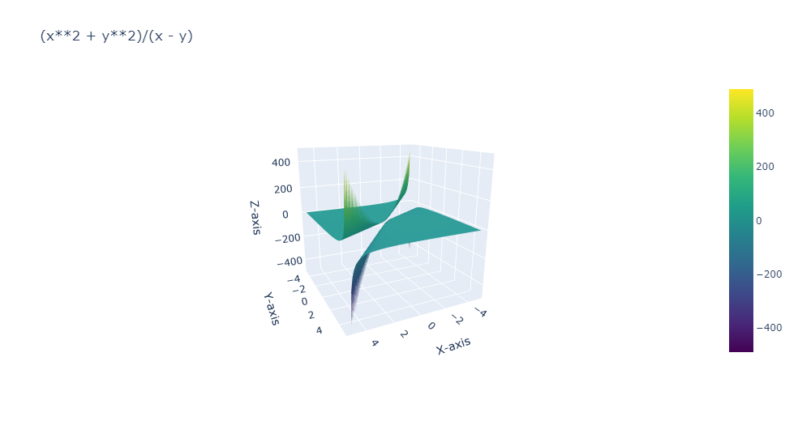
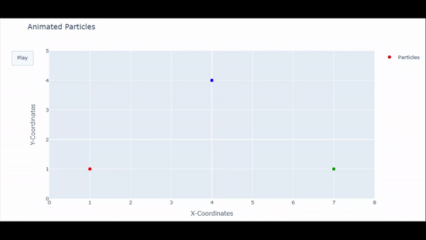
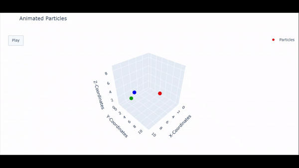

# pyEPVis
A package that allows you to easily visualize single or two variable functions and allows you to visualize particle/point movements along two or three Dimensions with an interactive plotly visualization.

## Used for Development


## Using the package

Install the package using the command
```
pip install pyEPVis
```
### Visualizing Single Variable Functions
```
from pyEPVis import do_fx_plot
do_fx_plot(formula = "x**4 - 10*(x**3) - 2*(x**2) - 5*x + 4",xstart = -100,xend = 100,step = 1).show()
```


### Visualizing Double Variable Functions
```
from pyEPVis import do_fxy_plot
do_fxy_plot(formula = "(x**2 + y**2)/(x - y)",xstart = -5,xend = 5,ystart = -5,yend = 5,step = 0.1,colorscale = 'Viridis').show()
```


### Visualizing 2D Particle Movements
```
from pyEPVis import animate_xy_particles
animate_xy_particles(x = [[1,4,7],[4,7,1],[7,1,4],[1,4,7]],y = [[1,4,1],[4,1,1],[1,1,4],[1,4,1]],colors = ["red","blue","green"]).show()
```


### Visualizing 3D Particle Movements
```
from pyEPVis import animate_xyz_particles
animate_xyz_particles(x = [[1,8,7],[3,3,6],[1,1,1]],y = [[5,2,2],[7,9,0],[5,2,6]],z = [[1,2,3],[4,5,6],[7,1,1]],colors = ["red","green","blue"],framespmov = 15).show()
```


## Warnings
* ***(Note: for function evaluation please stick to x and y and not other variables as it will lead to evaluation errors and framespmove should be high in order to visulaize the movement smoothly in animate_xyz_particles)***

## Other Help
* Use the **help(enter_function_name_here)** function to refer to the full documentation of the function.
* The figure is a plotly.graph_objects.Figure variable it can be further modified for including more plots inside the figure.
* All math package syntaxes along with python expressions are supported as well, to use the math package in your formula and use it as follows: **math.enter_function_name()**